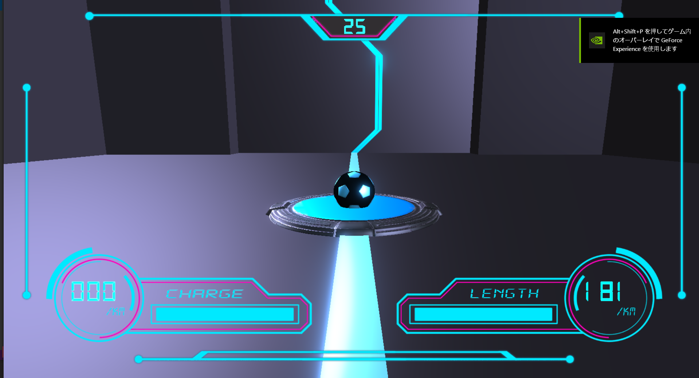
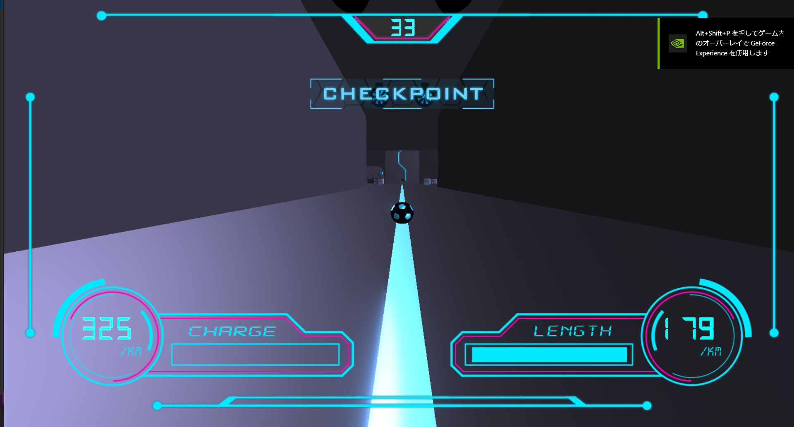
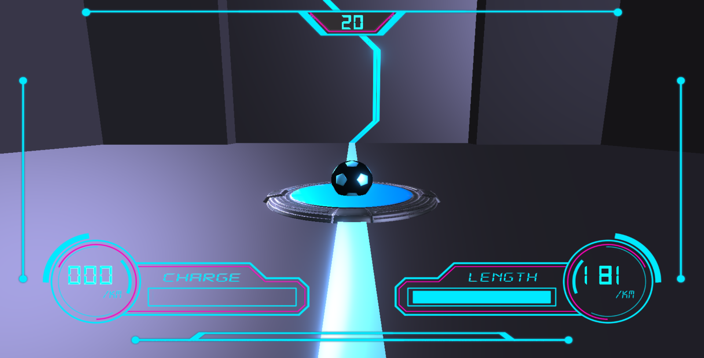
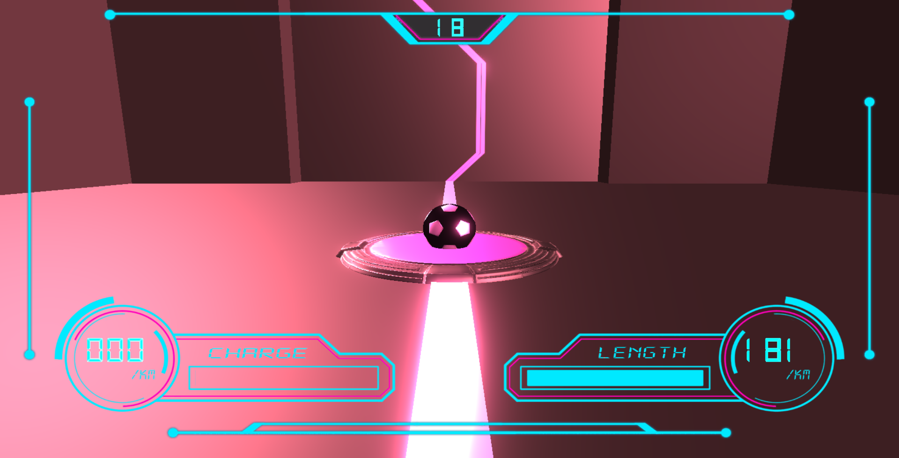

# GrAbility   

# 紹介動画  
<iframe width="560" height="315" src="https://www.youtube.com/embed/JfZP9xSGWfo" title="YouTube video player" frameborder="0" allow="accelerometer; autoplay; clipboard-write; encrypted-media; gyroscope; picture-in-picture" allowfullscreen></iframe>  

# 作品概要

- ## 作品名
  - Grabillity

- ## 学校
  - 河原電子ビジネス専門学校

- ## 制作人数
  - 3人

- ## 製作期間
  - 2022年2月～2021年5月
    
- ## プレイ人数
  - 1人

- ## 対応ハード
  - PC Windows10

- ## 使用言語
  - C++
  - HLSL

- ## 制作環境

  - エンジン
    - 学校内製の簡易エンジン(DirectX12)
  - プログラム
    - Visual Studio 2022
  - 3Dモデル
    - Blender
    - 3DSMax
  - エフェクト
    - Effeckseer
  - バージョン管理
    - GitHub
  - タスク管理
    - Redmine
- ## GitHubURL
  - https://github.com/YuMild/GameAwards

- ## 備考
    - 日本ゲーム大賞2022「アマチュア部門」に応募
    - 日本ゲーム大賞2022「アマチュア部門」一次審査通過

# ゲーム内容
リアルタイムでボールを弾いてギミックを攻略しながら制限時間内にゴールを目指す3Dアクションゲームです。

# 操作説明

</img>   
</img>   

# 担当ソースコード

## 好村 雄真

- SpriteRender.h(一部)  
  (画像の切り取り処理を行う関数の追加)
- PowerCharge.cpp
- PowerCharge.h
- LockOn.cpp
- LockOn.h
- BreakBox.cpp
- BreakBox.h
- Bumper.cpp
- Bumper.h
- Door.cpp
- Door.h
- Drone.cpp
- Drone.h
- Duct.cpp
- Duct.h
- Energy.cpp
- Energy.h
- Engine.cpp
- Engine.h
- Goal.cpp
- Goal.h
- HoneyCombBlock.cpp
- HoneyCombBlock.h
- JumpBoard.cpp
- JumpBoard.h
- Nut.cpp
- Nut.h
- Pipe.cpp
- Pipe.h
- ReSpawnPoint.cpp
- ReSpawnPoint.h
- SignBoard.cpp
- SignBoard.h
- SpeedUpRail.cpp
- SpeedUpRail.h
- Truck.cpp
- Truck.h
- Turret.cpp
- Turret.h
- Volt.cpp
- Volt.h
- Stage_1.cpp
- Stage_1.h
- Stage_1_Stage.cpp
- Stage_1_Stage.h
- Stage_1_Wall.cpp
- Stage_1_Wall.h
- ChargeShot.cpp
- ChargeShot.h
- Length.cpp
- Length.h
- TimeLimit.cpp
- TimeLimit.h
- Window.cpp
- Window.h
- First.cpp
- First.h
- Game.cpp
- Game.h
- GameClear.cpp
- GameClear.h
- GameOver.cpp
- GameOver.h
- Setting.cpp
- Setting.h
- Title.cpp
- title.h
- GameLight.cpp
- GameLight.h
- Player.cpp
- Player.h
- LockOnObject.cpp
- LockOnObject.h

# 技術紹介

## 当たり判定
RigitBodyにカメラ方向への力を加算し物理演算する事でプレイヤーの操作を行う都合上、メッシュに合わせてコライダーを自動生成するメッシュコライダーではすり抜けが多発してしまいます。

ですので、通常60FPSで一度のみの当たり判定を行っている処理を4回に増やし、当たり判定のみ疑似的に240FPSで実行しています。

しかし、それでも稀にすり抜けが発生してしまいましたので、3DSMaxにて配置したBoxオブジェクトの位置、大きさ、回転をC++側で読み取り、Boxコライダーとして配置するシステムを取り入れました。上記の二つの方法を取り入れた後はすり抜けが発生しなくなりました。

## ロックオン
ロックオン可能なオブジェクトはLockOnObjectという基底オブジェクトを派生クラスとして作成し、LockOnObjectのポジションを都度取得します。その後、全てのLockOnObjectとプレイヤー自身の距離を求め、一番近いオブジェクトのワールド座標をスクリーン座標に変換して実装しています。

## カメラ移動
スピード感を演出する為に、プレイヤの速度に応じてカメラの追従の速度を変化させています。  
</img>   
</img>   

## 制限時間の表現
制限時間が迫っている時の危機感を演出する為に、残り時間が一定を下回ると、Model描画時のColorにRを加算し、3Dモデルのみ赤みを帯びさせています。

</img>   
</img>   